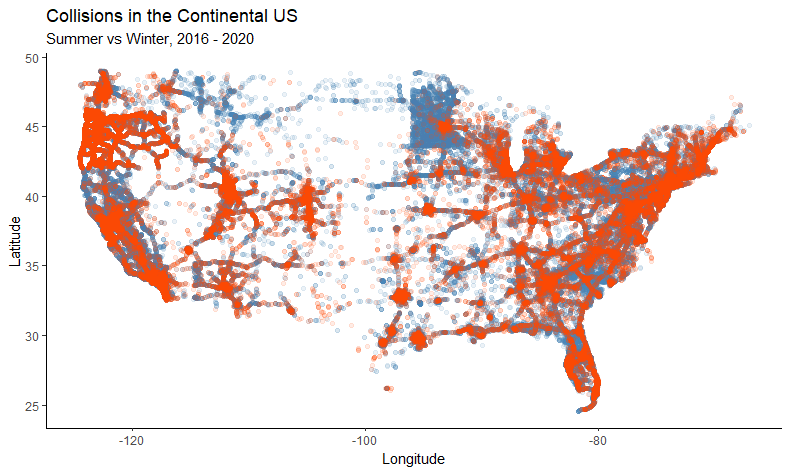

# Pandemic Collision Patterns

 - The sharp outlines of Minnesota, and to some extent Oregon, show that in these states a greater fraction of accidents get reported compared to neighboring states. 
 - Minnesota, the Dakotas, and Montana seem to have more winter traffic accidents (which makes sense!)
 - While the rest of the country is more mixed, it seems like smaller, more rural roads are more dangerous in winter than summer (In fact, this is true. See below)

work in progress!
